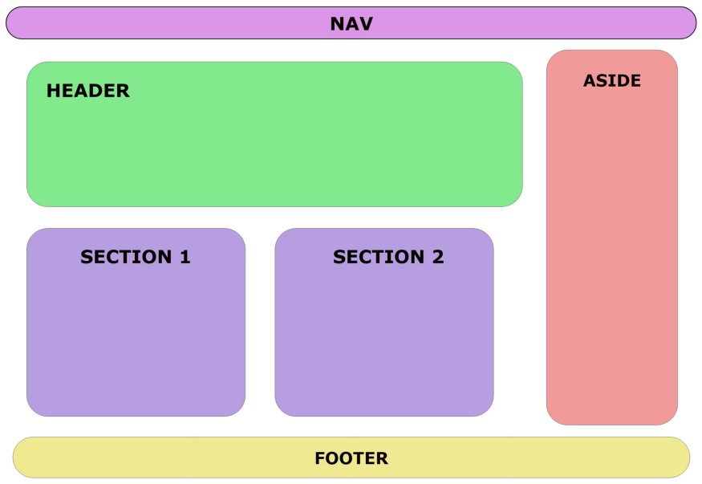

# < figure >

Elemento utilizado para envolver a inserção de figuras/imagens e seus atributos. Trás a possibilidade de atribuição de descrição da figura através da tag **\<figcaption>**, envolvendo tudo isto em um elemento específico.

Exemplo de código:

```html
<figure>
  <figure>
    
    <figcaption>Exemplo da disposição de elementos semânticos</figcaption>
  </figure>
</figure>
```

## Não esqueça do alt! - atributo da tag 

Este elemento é importantíssimo para promover a acessibilidade do seu conteúdo. O **alt** contém uma descrição da imagem que você está subindo para sua página e será esta descrição que o deficiente visual escutará quando o leitor de voz passar por este trecho de código.

Portanto, seja específico: descrever a cena representada na imagem, as cores, expressões faciais ou qualquer outro detalhe pode ajudar.

Exemplo de código:

```html
<img src="./foto.jpg" alt="fotografia de duas pessoas trocando informações no ambiente de trabalho."
```
